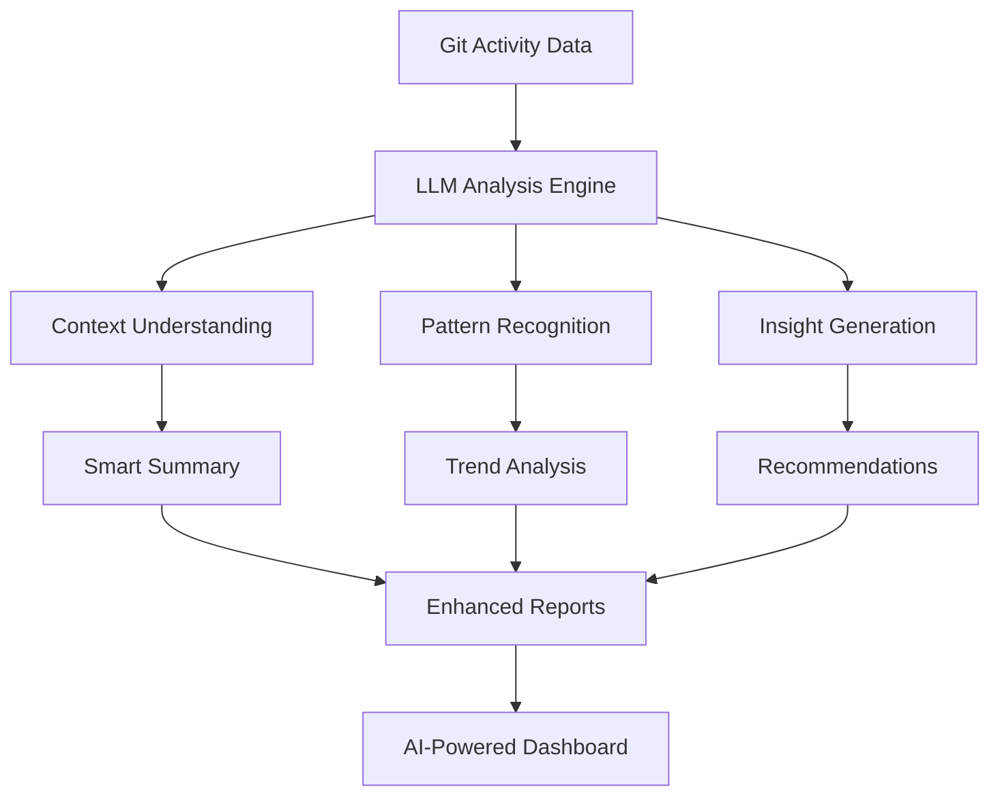

<div align="center">


# 📊 Daily Report Hub P.A.N.D.A

## Performance Analytics & Navigation for Development Activities

> [!IMPORTANT]
> **自動日報生成・集約システム**  
> GitHub Actionsを活用したCI/CDベースの開発活動レポートハブ


</div>

## 🌟 概要

Daily Report Hubは、複数のリポジトリから自動的に開発活動データを収集し、美しいドキュメントサイトとして公開するシステムです。GitHub Actionsワークフローを通じて、コミット履歴、コード差分、統計情報を自動的に集約・整理し、週次・日次レポートを生成します。

**🚀 次世代機能**: LLM統合により、単なるデータ収集を超えた**インテリジェントな開発分析プラットフォーム**へと進化予定です。

## 🏗️ システム構成

### 📂 プロジェクト構造

```
daily-report-hub/
├── 📁 docs/                          # Docusaurusサイト
│   ├── 📁 docs/activities/           # 活動レポート
│   │   └── 📁 2025/                  # 年別フォルダ
│   │       └── 📁 week-32_2025-08-11_to_2025-08-17/
│   │           └── 📁 2025-08-11/    # 日別フォルダ
│   │               └── 📁 [repo-name]/
│   │                   ├── 📄 daily_summary.md
│   │                   ├── 📄 daily_commits.md
│   │                   ├── 📄 daily_code_diff.md
│   │                   ├── 📄 daily_diff_stats.md
│   │                   ├── 📄 latest_diff.md
│   │                   ├── 📄 metadata.json
│   │                   └── 📄 README.md
│   ├── 📄 docusaurus.config.ts       # サイト設定
│   ├── 📄 sidebars.ts                # サイドバー設定
│   └── 📄 package.json               # 依存関係
├── 📁 .github/workflows/             # CI/CD設定
└── 📄 README.md                      # このファイル
```

## 🔄 自動化ワークフロー

### 📊 データ収集プロセス

1. **トリガー**: 連携リポジトリでのpush/PR作成
2. **データ抽出**: Git履歴・差分・統計情報の収集
3. **レポート生成**: Markdown形式での日報作成
4. **構造化**: Docusaurus対応のディレクトリ構造で整理
5. **同期**: 本リポジトリへの自動コミット・プッシュ
6. **公開**: GitHub Pagesでの自動デプロイ

### 🤖 LLM統合ワークフロー (開発中)



**予定機能**:
- 📝 **自動要約**: コミット内容の自然言語要約
- 🔍 **パターン分析**: 開発習慣・傾向の自動検出
- 💡 **改善提案**: コード品質・効率性の向上案
- 📊 **予測分析**: プロジェクト進捗・リスクの予測
- 🎯 **目標設定**: データ駆動型の開発目標提案

### 📈 生成されるレポート

| レポート種別   | ファイル名            | 内容                   |
| -------------- | --------------------- | ---------------------- |
| 📝 日次サマリー | `daily_summary.md`    | その日の活動概要・統計 |
| 💻 コミット詳細 | `daily_commits.md`    | 全コミットの詳細情報   |
| 🔄 コード差分   | `daily_code_diff.md`  | 完全なコード変更内容   |
| 📊 変更統計     | `daily_diff_stats.md` | ファイル変更統計       |
| 🆕 最新変更     | `latest_diff.md`      | 最新コミットの変更     |
| 📋 メタデータ   | `metadata.json`       | 構造化された活動データ |

## 🛠️ 技術スタック

### フロントエンド
- **Docusaurus 3.8.0**: 静的サイトジェネレーター
- **React 19.0.0**: UIコンポーネント
- **TypeScript**: 型安全な開発
- **MDX**: Markdown + React

### CI/CD & インフラ
- **GitHub Actions**: 自動化ワークフロー
- **GitHub Pages**: 静的サイトホスティング
- **Node.js 18+**: ランタイム環境

### 🤖 AI/LLM統合 (開発予定)
- **LLM API**: 自動レポート分析・要約生成
- **自然言語処理**: コミットメッセージの意図解析
- **インサイト生成**: 開発パターンの自動検出
- **推奨事項**: コード品質・生産性向上の提案

## 📊 リポジトリ統計

### 🌐 基本情報
- **リモートURL**: https://github.com/Sunwood-ai-labsII/daily-report-hub.git
- **デフォルトブランチ**: main
- **作成日時**: 2025-08-11 16:21:59
- **総コミット数**: 28

### 📁 プロジェクト規模
- **総ディレクトリ数**: 22
- **総ファイル数**: 47
- **最大深度**: 7層
- **総行数**: 5,643行

### 👥 主要コントリビューター
| 名前               | コミット数 |
| ------------------ | ---------- |
| Maki               | 15         |
| GitHub Actions Bot | 13         |

### 📈 言語別統計
| 言語       | ファイル数 | 総行数 | 合計サイズ |
| ---------- | ---------- | ------ | ---------- |
| Markdown   | 21         | 4,423  | 140.9 KB   |
| YAML       | 10         | 445    | 9.2 KB     |
| TypeScript | 2          | 184    | 5.3 KB     |
| JSON       | 12         | 150    | 3.5 KB     |
| CSS        | 3          | 64     | 1.6 KB     |

## 🚀 セットアップ & 使用方法

### 📋 前提条件
- Node.js 18.0以上
- npm または yarn
- Git

### 🔧 ローカル開発

```bash
# リポジトリをクローン
git clone https://github.com/Sunwood-ai-labsII/daily-report-hub.git
cd daily-report-hub

# 依存関係をインストール
cd docs
npm install

# 開発サーバーを起動
npm start
```

### 🌐 本番ビルド

```bash
# 本番用ビルド
npm run build

# ローカルで確認
npm run serve
```

## 🔗 連携リポジトリの設定

### 必要なワークフローファイル

連携したいリポジトリに以下のワークフローを追加：

```yaml
name: Sync to Daily Report Hub
on:
  push:
    branches: [main, master]
  pull_request:
    types: [opened, synchronize, closed]

env:
  WEEK_START_DAY: 1 # 週の開始日設定

jobs:
  sync-data:
    runs-on: ubuntu-latest
    steps:
      - uses: actions/checkout@v4
        with:
          fetch-depth: 0
      
      # スクリプト実行...
```

### 🔐 必要なシークレット

- `GH_PAT`: GitHub Personal Access Token
- `REPORT_HUB_REPO`: このリポジトリの名前

## 📊 サンプルレポート

現在、以下のサンプルプロジェクトのレポートが確認できます：

- **daily-report-hub_sample1**: おみくじアプリのサンプルプロジェクト
  - HTML5/CSS3/JavaScript製
  - 26コミット、14ファイル変更
  - 完全なワイヤーフレーム設計

## 🔮 ロードマップ

### Phase 1: 基盤構築 ✅
- [x] 自動日報生成システム
- [x] Docusaurusベースのサイト構築
- [x] GitHub Actions CI/CD
- [x] 多リポジトリ対応

### Phase 2: LLM統合 🚧
- [ ] LLM API統合基盤
- [ ] 自動要約機能
- [ ] コミット意図解析
- [ ] 開発パターン検出

### Phase 3: 高度な分析 🔄
- [ ] 予測分析機能
- [ ] チーム生産性分析
- [ ] 自動改善提案
- [ ] カスタムダッシュボード

### Phase 4: エンタープライズ機能 📋
- [ ] 多チーム対応
- [ ] 権限管理システム
- [ ] 高度なレポート機能
- [ ] API公開

## 🌟 特徴

### ✨ 自動化
- **完全自動**: 手動作業不要の日報生成
- **リアルタイム**: コミット即座にレポート更新
- **多リポジトリ対応**: 複数プロジェクトの一元管理

### 📱 ユーザビリティ
- **レスポンシブ**: モバイル対応の美しいUI
- **検索機能**: 高速な全文検索
- **ナビゲーション**: 直感的な日付・週別ブラウジング

### 🔧 拡張性
- **プラグイン対応**: Docusaurusエコシステム活用
- **カスタマイズ**: テーマ・レイアウト変更可能
- **API連携**: 外部サービスとの統合

### 🧠 AI駆動インサイト (近日公開)
- **スマート分析**: LLMによる開発活動の深層分析
- **自動レビュー**: コード変更の品質評価
- **学習機能**: チーム固有のパターン学習
- **予測機能**: 将来の開発トレンド予測

## 📝 ライセンス

このプロジェクトはMITライセンスの下で公開されています。

## 🤝 コントリビューション

プロジェクトへの貢献を歓迎します！

1. このリポジトリをフォーク
2. 機能ブランチを作成 (`git checkout -b feature/amazing-feature`)
3. 変更をコミット (`git commit -m 'Add amazing feature'`)
4. ブランチにプッシュ (`git push origin feature/amazing-feature`)
5. プルリクエストを作成

## 📞 サポート

- 📧 **Issues**: [GitHub Issues](https://github.com/Sunwood-ai-labsII/daily-report-hub/issues)
- 📖 **Documentation**: [GitHub Pages](https://sunwood-ai-labs.github.io/daily-report-hub/)
- 💬 **Discussions**: [GitHub Discussions](https://github.com/Sunwood-ai-labsII/daily-report-hub/discussions)

---

<div align="center">

**🚀 Powered by Docusaurus | 🤖 Automated by GitHub Actions | 🧠 Enhanced by AI | 💝 Made with Love**

</div>
