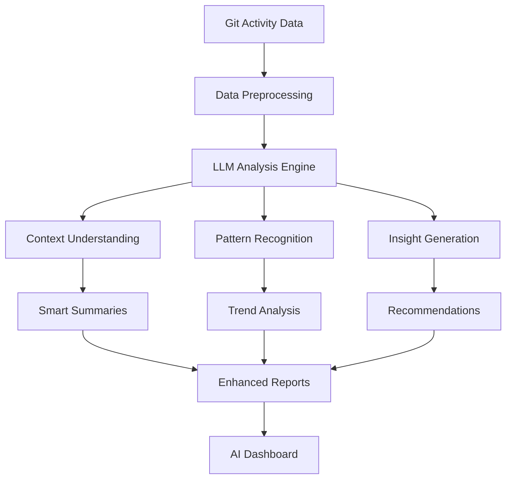

# 🤖 AI機能

Daily Report Hub は **AI駆動の開発分析プラットフォーム** へと進化しています。これから実装される機能と、それがあなたの開発ワークフローをどう変革するかをご紹介します。

## 🧠 ビジョン: インテリジェント開発分析

単純なデータ収集を超えて、AI統合により **深いインサイト**、**予測分析**、**実行可能な推奨事項** を提供し、開発プロセスを向上させます。

## 🔮 予定されているAI機能

### 📝 スマート要約
**LLM駆動のレポート生成**

生のコミットデータの代わりに、インテリジェントな要約を取得：

```markdown
## 2025-08-11のAI要約

🎯 **重点領域**: フロントエンドUI改善とAPI最適化
🚀 **主要成果**: ユーザー認証システムの完成
⚠️ **潜在的課題**: 決済モジュールの高い複雑性
💡 **推奨事項**: 保守性向上のため決済ロジックのリファクタリングを検討
```

**機能**:
- 自然言語によるコミット要約
- コンテキストを理解した活動説明
- 作業タイプのインテリジェントな分類
- 重要な変更の自動ハイライト

### 🔍 Pattern Recognition
**Development Behavior Analysis**

AI will identify patterns in your development workflow:

- **🕐 Productivity Patterns**: Optimal coding hours and peak performance times
- **🔄 Code Review Cycles**: Average review time and bottleneck identification
- **📊 Complexity Trends**: Code complexity evolution over time
- **🎯 Focus Areas**: Automatic detection of project focus shifts

### 💡 Intelligent Recommendations
**AI-Driven Improvement Suggestions**

Get personalized recommendations based on your data:

```json
{
  "recommendations": [
    {
      "type": "productivity",
      "message": "Consider breaking large commits into smaller, focused changes",
      "confidence": 0.85,
      "impact": "high"
    },
    {
      "type": "code_quality",
      "message": "Recent changes show increased complexity - consider refactoring",
      "confidence": 0.72,
      "impact": "medium"
    }
  ]
}
```

### 📈 Predictive Analytics
**Future Trend Forecasting**

AI will help predict:

- **🎯 Project Completion**: Estimated delivery dates based on current velocity
- **⚠️ Risk Assessment**: Potential bottlenecks and technical debt accumulation
- **👥 Team Dynamics**: Collaboration patterns and workload distribution
- **🔧 Maintenance Needs**: Code areas likely to require future attention

## 🛠️ Technical Implementation

### LLM Integration Architecture



### Supported LLM Providers

We plan to support multiple LLM providers:

- **OpenAI GPT-4**: Advanced reasoning and code understanding
- **Anthropic Claude**: Long-context analysis for large codebases
- **Local Models**: Privacy-focused on-premise deployment
- **Custom Fine-tuned**: Domain-specific development insights

### Privacy & Security

**Data Protection**:
- 🔒 **Local Processing**: Option for on-premise LLM deployment
- 🛡️ **Anonymization**: Automatic removal of sensitive information
- 🔐 **Encryption**: End-to-end encryption for data transmission
- 📋 **Compliance**: GDPR and enterprise security standards

## 🎯 Use Cases

### For Individual Developers

**Personal Productivity Insights**:
- Identify your most productive coding patterns
- Get suggestions for improving code quality
- Track skill development over time
- Receive personalized learning recommendations

### For Development Teams

**Team Analytics**:
- Understand team collaboration patterns
- Identify knowledge silos and dependencies
- Optimize code review processes
- Balance workload distribution

### For Project Managers

**Project Intelligence**:
- Real-time project health monitoring
- Predictive delivery date estimation
- Risk identification and mitigation
- Resource allocation optimization

## 🚀 Roadmap

### Phase 1: Foundation (Q1 2025)
- [ ] LLM API integration framework
- [ ] Basic commit message analysis
- [ ] Simple pattern recognition
- [ ] Privacy-first architecture

### Phase 2: Intelligence (Q2 2025)
- [ ] Advanced code understanding
- [ ] Predictive analytics engine
- [ ] Recommendation system
- [ ] Custom dashboard creation

### Phase 3: Automation (Q3 2025)
- [ ] Automated workflow suggestions
- [ ] Intelligent alert system
- [ ] Integration with development tools
- [ ] Advanced team analytics

### Phase 4: Enterprise (Q4 2025)
- [ ] Multi-organization support
- [ ] Advanced security features
- [ ] Custom model training
- [ ] Enterprise integrations

## 🧪 Beta Program

Want early access to AI features?

**Join our Beta Program**:
1. 📧 **Sign up**: Email us at [beta@daily-report-hub.com](mailto:beta@daily-report-hub.com)
2. 🔧 **Requirements**: Active Daily Report Hub usage
3. 📝 **Feedback**: Help shape the AI features
4. 🎁 **Benefits**: Free access to premium AI features

## 💭 Feedback & Ideas

We want to build AI features that truly help developers. Share your ideas:

- **What insights would be most valuable to you?**
- **Which development patterns should we analyze?**
- **How can AI best support your workflow?**

💬 **Join the Discussion**: [GitHub Discussions](https://github.com/Sunwood-ai-labsII/daily-report-hub/discussions)

## 🔬 Research & Development

Our AI development is guided by:

- **📊 Data Science**: Statistical analysis of development patterns
- **🧠 Machine Learning**: Pattern recognition and prediction models
- **🤖 Natural Language Processing**: Code and commit understanding
- **👥 Human-Computer Interaction**: User-centered AI design

---

The future of development analytics is intelligent, predictive, and personalized. Join us in building it! 🚀

*AI features are currently in development. Timeline and features subject to change based on research and user feedback.*