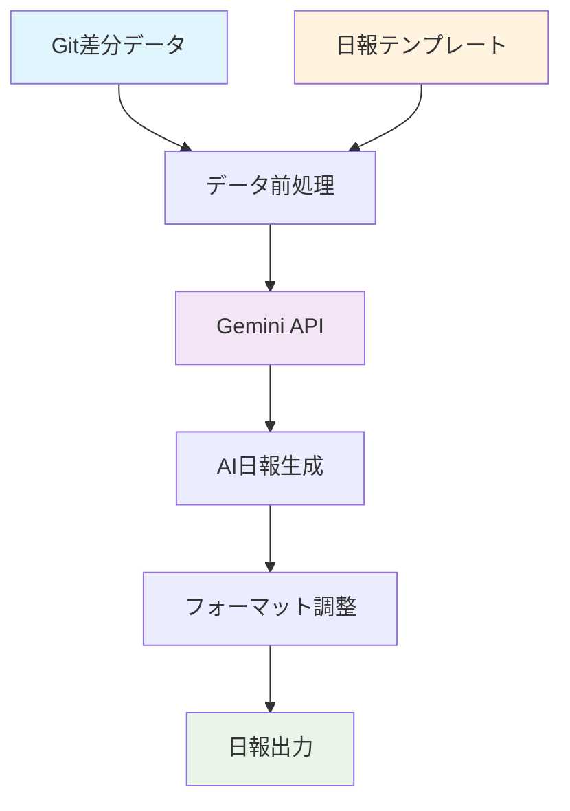

# 🤖 AI機能

Daily Report Hub に **AI日報生成機能** を追加予定です。Git差分と日報テンプレートから、自動で日報を作成します。

## 🎯 機能概要

### 📝 AI日報生成
**Git差分 + テンプレート → 自動日報作成**

```markdown
## 入力
- Git差分データ（コミット履歴、変更ファイル等）
- 日報テンプレート

## 出力
- 自動生成された日報
```

### 💡 基本的な流れ

1. **📊 差分データ取得**: Gitから当日の変更を収集
2. **📋 テンプレート適用**: 設定済みの日報フォーマットを使用
3. **🤖 AI処理**: LLMが差分を解析して日報を生成
4. **📄 レポート出力**: 読みやすい日報として出力

### 🔧 想定される出力例

```markdown
## 2025-08-11 日報

### 今日の作業
- ユーザー認証機能の実装
- API エラーハンドリングの改善
- テストケースの追加

### 変更ファイル
- `auth/login.js` - ログイン処理の修正
- `api/users.js` - エラーレスポンス改善
- `tests/auth.test.js` - 認証テスト追加

### 進捗状況
- 認証機能: 80%完了
- API改善: 完了
```

## 🛠️ 技術仕様

### AI日報生成フロー



### サポート予定のLLM
- **Google Gemini**: 無料APIを活用
- **ローカルモデル**: プライバシー重視の場合（将来的に）

### プライバシー
- 🔒 コード内容は要約のみ送信
- 🛡️ 機密情報の自動除外
- 📋 ローカル処理オプション

## 🚀 実装予定

### 2025年Q1
- [ ] 基本的なAI日報生成
- [ ] シンプルなテンプレート対応
- [ ] OpenAI API連携

### 2025年Q2  
- [ ] カスタムテンプレート
- [ ] ローカルLLM対応
- [ ] 出力フォーマット選択

---

*シンプルで実用的なAI日報生成を目指します！*